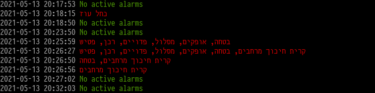

# 🚨 Pikud Ha'oref Alarm Tracking

[](https://github.com/yuvadm/alarmpy/actions/workflows/build.yml)
[](https://pypi.org/project/alarmpy/)

A simple CLI tool for tracking Pikud Ha'oref alarms.

Polls the unofficial API endpoint every second for incoming alarms. Prints active alarms as they occur. Prints routine messages once every 5 minutes by default.



## ⚠️ Disclaimer ⚠️

This tool is based on an unofficial API, and cannot be guaranteed to show correct or timely data. **Do not** use it if human life is at stake. **Do not** assume it shows you correct data. **Do not** assume it works properly, or even works at all. Always follow official guidelines and procedures published by [Pikud Ha'oref](https://www.oref.org.il/).

Further fine-print covering the terms of use of this tool can be found in the [GPLv3 license](LICENSE) file.

## Install

### Pip

The easiest way to install is from PyPI with `pip`:

```bash
$ pip install alarmpy
```

You can then run the `alarmpy` executable directly:

```bash
$ alarmpy --help
```

### Pipenv

For development usage it's recommended to clone the git repo and use `pipenv`:

```bash
$ git clone https://github.com/yuvadm/alarmpy
$ cd alarmpy
$ pipenv sync -d
$ pipenv run alarmpy
```

## Usage

For the default usage after installation, just run:

```bash
$ alarmpy
```

### Display

- Set the output language using `--language [en|he|ar|ru]`, this uses the official city and area name translations for Hebrew, Arabic, English and Russian.
- In case of RTL issues in the terminal use `--reverse` to output all names in reverse.
- Use `--highlight abc` in order to highlight any alarm which contains the string `abc`.

### Proxy

The unofficial API is limited for use for Israeli-originating IPs only. In order to use alarmpy from outside Israel, users must route traffic through an Israeli exit point. The `HTTPS_PROXY` environment variable is supported for this use case.

### Advanced

Advanced flags can be set as described in the usage:

```bash
$ pipenv run alarmpy --help
Usage: alarmpy.py [OPTIONS]

Options:
  --language [en|he|ar|ru]  Alert language
  --highlight TEXT          String to search for and highlight in case of
                            alarm
  --reverse                 Reverse Hebrew/Arabic output for terminals with
                            RTL bugs
  --polling-delay INTEGER   Polling delay in seconds
  --routine-delay INTEGER   Routine message delay in seconds
  --alarm-id                Print alarm IDs
  --repeat-alarms           Do not suppress ongoing alarms
  --quiet                   Print only active alarms
  --desktop-notifications   Create push notifications on your desktop
                            notification center (currently only in Mac OS)
  --mqtt-server TEXT        Hostname / IP of MQTT server (optional)
  --mqtt-client-id TEXT     MQTT client identifier
  --mqtt-port INTEGER       Port for MQTT server
  --mqtt-topic TEXT         Topic on which to send MQTT messages
  --mqtt-filter TEXT        Payload value to filter before sending as a
                            message (semicolon separated)
  --output-test             Print a debug output and exit
  --help                    Show this message and exit.
```

### MQTT Notifications

Integration with an MQTT server provides the ability to send custom MQTT messages for all or some of the alerts that are received. MQTT requires [`paho-mqtt`](https://pypi.org/project/paho-mqtt/) to be installed separately as an optional dependency.

To enable, specify at least the following parameters via the command line:

- `mqtt-server` - The MQTT Server hostname or IP, e.g. `localhost`
- `mqtt-topic` - The MQTT topic to which the MQTT message will be sent, e.g. `alarmpy/zone`

Additional optional parameters for MQTT integration are:

- `mqtt-client-id` - The ID of the MQTT client used by alarmpy. This will be used to connect to the MQTT server. Default: `alarmPyClient`. This only needs to be change in case you plan to have more than one instance of alarmpy running
- `mqtt-port` - The port on which the MQTT server is listening to. Default: `1883`

#### Filtering

When MQTT is enabled, all alerts are sent as separate messages on the specified topic. In case there is a desire to include only specific alert, use the `mqtt-filter` parameter to provide a semicolon separated list of substrings enclosed in double quotes. Each alert city and area will be checked against all filters, and only when a match is found, will an MQTT message be sent. For example: `--mqtt-filter "gaza;negev"`.

## License

[GPLv3](LICENSE)
